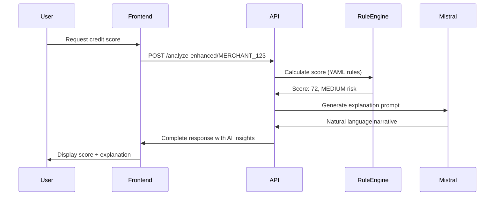

# Mistral Devstral Small Integration Guide

## Overview

This guide explains how to integrate Mistral AI's **Devstral Small 1.0** model (`devstral-small-2505`) to provide natural language explanations of credit scores to users in the OpenCredit platform.

## Why Mistral Devstral Small?

**Devstral Small 1.0** is a 24B parameter open-source model specifically designed for:
- Technical and code explanations
- Tool integration and function calling
- Structured outputs
- Cost-effective API usage
- Software development tasks

For OpenCredit, this model is ideal because it can:
1. **Explain complex rule-based calculations** in simple language
2. **Generate personalized insights** based on financial metrics
3. **Provide actionable recommendations** for credit score improvement
4. **Power conversational AI** for credit-related questions
5. **Maintain transparency** while being cost-effective

## Architecture

OpenCredit uses a **Hybrid Rules + AI Architecture**:

```
┌─────────────────────────────────────────────┐
│           Rule Engine (YAML-based)          │
│  ✓ Makes ALL credit decisions               │
│  ✓ Calculates scores deterministically      │
│  ✓ Determines eligibility                   │
│  ✓ Auditable and transparent                │
└──────────────────┬──────────────────────────┘
                   │
                   │ Passes decision context
                   │
┌──────────────────▼──────────────────────────┐
│    Mistral Devstral Small (Explanations)    │
│  ✓ Explains why decisions were made         │
│  ✓ Generates natural language narratives    │
│  ✓ Provides personalized recommendations    │
│  ✓ Powers conversational Q&A                │
└─────────────────────────────────────────────┘
```

**Key Principle**: The rule engine makes decisions. Mistral explains them in user-friendly language.

## Integration Steps

### 1. Prerequisites

- **Java 17+** installed
- **Maven 3.8+** installed
- **Mistral AI API key** from [console.mistral.ai](https://console.mistral.ai)
- Running OpenCredit backend (Spring Boot)

### 2. Get Mistral API Key

1. Sign up at [console.mistral.ai](https://console.mistral.ai)
2. Navigate to API Keys section
3. Create a new API key
4. Copy the key (format: `xxxxx...`)

### 3. Configuration

#### Option A: Environment Variables (Recommended for Production)

```bash
export LLM_PROVIDER=MISTRAL
export LLM_API_KEY=your_mistral_api_key_here
export MISTRAL_MODEL=devstral-small-2505
export LLM_ENABLED=true
```

#### Option B: application.yml (Development)

Edit `src/main/resources/application.yml`:

```yaml
llm:
  enabled: true
  provider: MISTRAL
  api:
    api-key: your_mistral_api_key_here
  model:
    mistral-model: devstral-small-2505
    temperature: 0.7
    max-tokens: 2048
```

### 4. Start the Application

```bash
# Build the project
mvn clean install

# Run with Mistral configuration
mvn spring-boot:run
```

Or with environment variables:

```bash
LLM_PROVIDER=MISTRAL LLM_API_KEY=your_key mvn spring-boot:run
```

### 5. Verify Integration

Check the application logs for:

```
INFO  c.l.v.c.config.LlmConfig - LLM Provider: MISTRAL
INFO  c.l.v.c.config.LlmConfig - LLM Enabled: true
INFO  c.l.v.c.config.LlmConfig - Mistral Model: devstral-small-2505
```

## API Usage Examples

### 1. Get Credit Score with AI Explanation

```bash
curl -X POST "http://localhost:8080/api/v1/credit-assessment/analyze-enhanced/MERCHANT_123" \
  -H "Content-Type: application/json"
```

**Response**:
```json
{
  "merchantId": "MERCHANT_123",
  "creditScore": 72,
  "riskCategory": "MEDIUM",
  "eligible": true,
  "eligibleLoanAmount": 180000.00,
  "aiInsights": {
    "narrative": "Your credit score of 72 places you in the MEDIUM risk category...",
    "riskAnalysis": "Your business shows consistent revenue patterns...",
    "recommendations": [
      "Reduce bounce rate from 12% to below 10%...",
      "Diversify customer base to reduce concentration..."
    ]
  }
}
```

### 2. Get Natural Language Credit Narrative

```bash
curl "http://localhost:8080/api/v1/insights/MERCHANT_123/narrative"
```

**Response**:
```json
{
  "merchantId": "MERCHANT_123",
  "narrative": "Your credit profile demonstrates solid financial health with a score of 72 out of 100. Your business processes an average of ₹156,000 per month with good consistency (CV of 0.28). While your transaction volumes are healthy, there's room for improvement in customer diversification - currently 45% of revenue comes from your top 10 customers. Your low bounce rate of 8% indicates excellent payment reliability..."
}
```

### 3. Get Risk Analysis

```bash
curl "http://localhost:8080/api/v1/insights/MERCHANT_123/risk-analysis"
```

### 4. Get Personalized Recommendations

```bash
curl "http://localhost:8080/api/v1/insights/MERCHANT_123/recommendations"
```

### 5. Get 30-60-90 Day Improvement Plan

```bash
curl "http://localhost:8080/api/v1/insights/MERCHANT_123/improvement-plan"
```

### 6. Interactive Chat Interface

**Start a chat session**:
```bash
curl -X POST "http://localhost:8080/api/v1/chat/session/start" \
  -H "Content-Type: application/json" \
  -d '{"merchantId": "MERCHANT_123"}'
```

**Response**:
```json
{
  "sessionId": "session_abc123",
  "message": "Hello! I'm here to help you understand your credit profile..."
}
```

**Send a message**:
```bash
curl -X POST "http://localhost:8080/api/v1/chat/message" \
  -H "Content-Type: application/json" \
  -d '{
    "sessionId": "session_abc123",
    "merchantId": "MERCHANT_123",
    "message": "Why is my credit score 72 and not higher?"
  }'
```

## What Mistral Explains

The Mistral model generates explanations for:

### 1. **Credit Score Components** (5 factors)
- **Volume Score (30%)**: Monthly UPI transaction volumes
- **Consistency Score (25%)**: Income stability (Coefficient of Variation)
- **Growth Score (15%)**: Year-over-year business growth
- **Bounce Rate Score (15%)**: Failed payment percentage
- **Concentration Score (15%)**: Customer diversification

### 2. **Risk Category**
- LOW RISK (80-100): Best loan terms
- MEDIUM RISK (60-79): Standard terms
- HIGH RISK (0-59): Limited terms

### 3. **Eligibility Criteria**
- Minimum monthly volume (₹25,000)
- Minimum transactions (20)
- Maximum bounce rate (20%)
- Minimum tenure (3 months)
- Fraud indicators

### 4. **Loan Parameters**
- Eligible loan amount
- Interest rate
- Maximum tenure
- Risk-based adjustments

### 5. **Improvement Strategies**
- Specific actions to improve each component
- Timeline for expected improvements
- Prioritized recommendations

## Prompt Engineering

The system uses carefully crafted prompts that:

1. **Provide full context** to Mistral:
   - Complete financial metrics
   - Score breakdown by component
   - Applied rules and their results
   - Eligibility status and reasons

2. **Request specific output formats**:
   - Natural language narratives
   - Structured recommendations
   - Actionable improvement plans

3. **Maintain consistency**:
   - Professional, empathetic tone
   - Focus on financial inclusion
   - Avoid jargon, use simple language

Example prompt structure:
```
You are a financial advisor explaining credit scores to small business owners.

Merchant Financial Profile:
- Credit Score: 72/100 (MEDIUM RISK)
- Volume Score: 24.0/30 (Good)
- Consistency Score: 18.8/25 (Good)
...

Task: Explain in simple language why the merchant received this score...
```

## Monitoring and Debugging

### Check LLM Status

```bash
curl "http://localhost:8080/actuator/health"
```

### View Application Logs

```bash
tail -f logs/application.log
```

Look for:
- LLM API calls and responses
- Token usage
- Error messages
- Response times

### Common Issues

**Issue**: "LLM API key not configured"
**Solution**: Set `LLM_API_KEY` environment variable

**Issue**: "Rate limit exceeded"
**Solution**: Mistral has API rate limits. Check your plan at console.mistral.ai

**Issue**: "Model not found"
**Solution**: Ensure `MISTRAL_MODEL=devstral-small-2505` is correct

**Issue**: "Empty or invalid response from LLM"
**Solution**: Check API key validity and network connectivity

## Cost Optimization

Devstral Small is cost-effective, but you can optimize further:

1. **Cache frequently requested insights**
   - Store generated narratives in database
   - Regenerate only when assessment changes

2. **Adjust token limits**
   - Default: 2048 tokens
   - Reduce for shorter responses
   - Increase for detailed improvement plans

3. **Batch processing**
   - Generate insights asynchronously
   - Use background jobs for bulk updates

4. **Conditional generation**
   - Only generate insights when user requests them
   - Use `/analyze` endpoint without AI for faster responses
   - Use `/analyze-enhanced` when explanations are needed

## Security Best Practices

1. **Never expose API keys**
   - Use environment variables
   - Don't commit keys to git
   - Rotate keys regularly

2. **Validate user inputs**
   - All inputs are sanitized before sending to Mistral
   - No user content in system prompts

3. **Rate limiting**
   - Implement per-merchant rate limits
   - Prevent API abuse

4. **Data privacy**
   - Financial data sent to Mistral is for explanation only
   - No data storage on Mistral servers (per API terms)
   - Consider on-premise LLM (Ollama) for sensitive data

## Testing

### Unit Tests

```bash
mvn test -Dtest=LlmClientTest
```

### Integration Tests

```bash
# Test with demo scenarios
curl -X POST "http://localhost:8080/api/v1/demo/assess/healthy/TEST_MERCHANT"
curl "http://localhost:8080/api/v1/insights/TEST_MERCHANT/narrative"
```

### Load Testing

```bash
# Test concurrent requests
ab -n 100 -c 10 "http://localhost:8080/api/v1/insights/MERCHANT_123/narrative"
```

## Switching Between LLM Providers

OpenCredit supports multiple LLM providers. Switch easily:

**Mistral (Open Source, Cost-effective)**:
```bash
export LLM_PROVIDER=MISTRAL
export LLM_API_KEY=your_mistral_key
```

**OpenAI (Premium Quality)**:
```bash
export LLM_PROVIDER=OPENAI
export LLM_API_KEY=your_openai_key
export OPENAI_MODEL=gpt-4o
```

**Ollama (Local, Privacy-focused)**:
```bash
export LLM_PROVIDER=OLLAMA
export LLM_BASE_URL=http://localhost:11434
```

**FinGPT (Financial Domain)**:
```bash
export LLM_PROVIDER=FINGPT
export LLM_API_KEY=your_fingpt_key
```

## Production Deployment

### Docker Deployment

```dockerfile
# In your Dockerfile
ENV LLM_PROVIDER=MISTRAL
ENV LLM_API_KEY=${MISTRAL_API_KEY}
ENV MISTRAL_MODEL=devstral-small-2505
```

### Kubernetes

```yaml
apiVersion: v1
kind: Secret
metadata:
  name: llm-secrets
data:
  mistral-api-key: <base64-encoded-key>
---
apiVersion: apps/v1
kind: Deployment
spec:
  template:
    spec:
      containers:
      - name: opencredit
        env:
        - name: LLM_PROVIDER
          value: "MISTRAL"
        - name: LLM_API_KEY
          valueFrom:
            secretKeyRef:
              name: llm-secrets
              key: mistral-api-key
```

## Support and Resources

- **Mistral Documentation**: https://docs.mistral.ai
- **API Reference**: https://docs.mistral.ai/api
- **OpenCredit GitHub**: https://github.com/lumexpay/open-credit-core
- **Issue Tracker**: Report bugs and request features

## Next Steps

1. ✅ Get Mistral API key
2. ✅ Configure environment variables
3. ✅ Start the application
4. ✅ Test with demo scenarios
5. ✅ Integrate with your frontend
6. ✅ Monitor usage and costs
7. ✅ Iterate on prompts for better explanations

## Example: Complete User Flow



## Conclusion

Integrating Mistral Devstral Small provides OpenCredit users with:

✅ **Transparent explanations** of complex credit calculations
✅ **Personalized recommendations** for score improvement
✅ **Conversational AI** for credit-related questions
✅ **Cost-effective** open-source alternative
✅ **Production-ready** with full Spring Boot integration

The rule engine remains the source of truth for decisions, while Mistral makes those decisions understandable and actionable for users.
