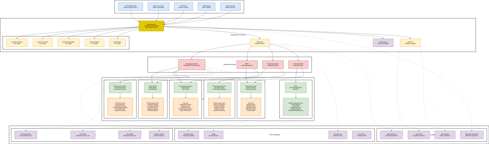

# 🏦 OpenCredit - Transparent Credit Assessment Engine

[](https://www.apache.org/licenses/LICENSE-2.0)
[](./src/main/resources/rules/)
[](https://openjdk.org/)

**Democratizing Credit Access Through Transparency**

OpenCredit is an open-source credit scoring platform that analyzes UPI transaction history to calculate credit scores, determine loan eligibility, and assess risk. Unlike traditional black-box scoring systems, **every rule is publicly visible and auditable**.

> 🎯 **Mission:** Financial inclusion for India's underserved populations through transparent, fair, and auditable credit scoring.

---

## 📑 Table of Contents

- [Why OpenCredit?](#-why-opencredit)
- [Features](#-features)
- [Architecture](#-architecture)
- [Quick Start](#-quick-start)
- [API Documentation](#-api-documentation)
- [Credit Scoring Rules](#-credit-scoring-rules)
- [AI-Powered Insights](#-ai-powered-insights)
- [Demo Mode](#-demo-mode)
- [Configuration](#-configuration)
- [Deployment](#-deployment)
- [Contributing](#-contributing)

---

## 🌟 Why OpenCredit?

### The Problem
Traditional credit scoring is a **black box**. Millions of small merchants, farmers, and MSMEs are denied credit without understanding why. This perpetuates financial exclusion, especially for marginalized communities.

### Our Solution
**Complete Transparency.** Every scoring rule is:
- 📖 **Publicly documented** in human-readable YAML
- 🔍 **Auditable** with full version history
- 🤝 **Community-governed** - anyone can propose improvements
- ⚖️ **Fair** - no hidden biases or discriminatory factors

### Who Benefits?
- 🏪 **Small Merchants** - Understand and improve their credit profile
- 🌾 **Farmers & MSMEs** - Access formal credit based on UPI activity
- 🏛️ **Cooperative Societies** - Transparent lending to members
- 👥 **Bahujan Communities** - Combat systemic discrimination in lending
- 🏦 **NBFCs & Small Finance Banks** - Auditable, RBI-compliant scoring

---

## ✨ Features

### Core Scoring Engine
- ✅ **Rule-Based Scoring** - Deterministic, auditable decisions (not ML black-box)
- ✅ **YAML Configuration** - Human-readable scoring rules
- ✅ **Real-time Assessment** - Score calculation in <100ms
- ✅ **Multi-Component Scoring** - Volume, consistency, growth, bounce rate, concentration
- ✅ **Eligibility Engine** - Configurable minimum requirements
- ✅ **Fraud Detection** - Pattern-based suspicious activity flagging

### Transparency & Compliance
- ✅ **Open Rules** - All scoring logic publicly visible
- ✅ **Version Control** - Complete changelog of rule modifications
- ✅ **Audit Trail** - Every decision traceable to specific rules
- ✅ **RBI Compliant** - Designed for regulatory requirements
- ✅ **Apache 2.0 Licensed** - Free for commercial use

### AI-Powered Insights (Hybrid Architecture)
- ✅ **Natural Language Explanations** - LLM explains rule-based decisions
- ✅ **Personalized Recommendations** - AI-generated improvement plans
- ✅ **Conversational Interface** - Chat with your credit score
- ✅ **Multiple LLM Providers** - OpenAI, FinGPT, Ollama support

### Developer Experience
- ✅ **RESTful API** - Comprehensive endpoints with Swagger docs
- ✅ **PDF Reports** - Professional credit assessment reports
- ✅ **Demo Mode** - Test with realistic mock data
- ✅ **Docker Ready** - One-command deployment

---

## 🏗️ Architecture


### Business Architecture


### Hybrid Approach: Rules + AI

```
┌───────────────────────────────────────────────────────────────────────-──┐
│                         OpenCredit Platform                              │
├────────────────────────────────────────────────────────────────────────-─┤
│                                                                          │
│   ┌──────────────────────────────────────────────────────────────────┐   │
│   │                        API Layer                                 │   │
│   │  ┌──────────┐ ┌──────────┐ ┌──────────┐ ┌──────────┐ ┌────────┐  │   │
│   │  │Assessment│ │ Insights │ │  Rules   │ │   Chat   │ │  Demo  │  │   │
│   │  │Controller│ │Controller│ │Controller│ │Controller│ │  API   │  │   │
│   │  └────┬─────┘ └────┬─────┘ └────┬─────┘ └────┬─────┘ └───┬────┘  │   │
│   └───────┼────────────┼────────────┼────────────┼───────────┼───────┘   │
│           │            │            │            │           │           │
│   ┌───────▼────────────▼────────────▼────────────▼───────────▼──────-─┐  │
│   │                      Service Layer                                │  │
│   │  ┌─────────────────────────────────────────────────────────────┐  │  │
│   │  │                Credit Assessment Service                    │  │  │
│   │  └──────────────────────────┬──────────────────────────────────┘  │  │
│   │                             │                                     │  │
│   │  ┌──────────────────────────┼─────────────────────────────────-─┐ │  │
│   │  │                          │                                   │ │  │
│   │  │   ┌──────────────────────▼──────────────────────-┐           │ │  │
│   │  │   │         🎯 RULE ENGINE (Source of Truth)     │           │ │  │
│   │  │   │                                              │           │ │  │
│   │  │   │  • scoring-rules.yaml                        │           │ │  │
│   │  │   │  • eligibility-rules.yaml                    │           │ │  │
│   │  │   │  • Deterministic decisions                   │           │ │  │
│   │  │   │  • 100% auditable                            │           │ │  │
│   │  │   │  • <5ms response time                        │           │ │  │
│   │  │   └──────────────────────┬──────────────────────-┘           │ │  │
│   │  │                          │                                   │ │  │
│   │  │   ┌──────────────────────▼────────────────────-──┐           │ │  │
│   │  │   │         🤖 LLM SERVICE (Explanations)        │           │ │  │
│   │  │   │                                              │           │ │  │
│   │  │   │  • Natural language explanations             │           │ │  │
│   │  │   │  • Personalized recommendations              │           │ │  │
│   │  │   │  • Conversational Q&A                        │           │ │  │
│   │  │   │  • Does NOT make decisions                   │           │ │  │
│   │  │   └────────────────────────────────────────────-─┘           │ │  │
│   │  │                                                              │ │  │
│   │  └──────────────────────────────────────────────────────────────┘ │  │
│   └───────────────────────────────────────────────────────────────────┘  │
│                                                                          │
├─────────────────────────────────────────────────────────────────-────────┤
│                    PostgreSQL │ Redis │ UPI Platform                     │
└──────────────────────────────────────────────────────────────────-───────┘
```

### Key Design Principle

| Component | Makes Decisions? | Purpose |
|-----------|-----------------|---------|
| **Rule Engine** | ✅ YES | Calculate scores, determine eligibility, set loan parameters |
| **LLM Service** | ❌ NO | Explain decisions, provide recommendations, answer questions |

**Why?** Regulatory compliance requires deterministic, auditable decisions. "AI decided" is not legally defensible. Rule-based decisions are. Please read detail guide [ Rule Vs LLM Decision](docs/RULE_VS_LLM_DECISION_GUIDE.md)

---

## 🚀 Quick Start

### Prerequisites
- Java 17+
- Maven 3.8+
- PostgreSQL 14+ (or H2 for testing)

### Option 1: Run with Docker (Recommended)

```bash
# Clone repository
git clone https://github.com/opencredit/opencredit-core.git
cd opencredit-core

# Start with Docker Compose
docker-compose up -d

# API available at http://localhost:8080
# Swagger UI: http://localhost:8080/swagger-ui.html
```

### Option 2: Run Locally

```bash
# Build
mvn clean package -DskipTests

# Run with mock data (no external dependencies)
java -jar target/opencredit-core-1.0.0.jar

# Test the API
curl http://localhost:8080/health
```

### Quick Test

```bash
# 1. Health check
curl http://localhost:8080/health

# 2. View scoring rules (transparency!)
curl http://localhost:8080/rules/methodology

# 3. Run demo assessment
curl -X POST "http://localhost:8080/demo/assess/excellent/DEMO_001"

# 4. Get AI-powered explanation
curl http://localhost:8080/insights/DEMO_001/narrative

# 5. Download PDF report
curl -o report.pdf http://localhost:8080/credit-assessment/report/DEMO_001/pdf
```

---

## 📚 API Documentation

### Endpoint Categories

| Category | Base Path | Purpose |
|----------|-----------|---------|
| **Assessment** | `/credit-assessment` | Core scoring and eligibility |
| **Insights** | `/insights` | AI-powered explanations |
| **Rules** | `/rules` | Transparency - view all rules |
| **Chat** | `/chat` | Conversational interface |
| **Demo** | `/demo` | Testing with mock data |

### Core Assessment Endpoints

| Method | Endpoint | Description |
|--------|----------|-------------|
| `POST` | `/credit-assessment/analyze/{merchantId}` | Trigger credit assessment |
| `GET` | `/credit-assessment/report/{merchantId}` | Get assessment report |
| `GET` | `/credit-assessment/eligibility/{merchantId}` | Check loan eligibility |
| `GET` | `/credit-assessment/report/{merchantId}/pdf` | Download PDF report |
| `POST` | `/credit-assessment/re-assess/{merchantId}` | Force re-assessment |
| `GET` | `/credit-assessment/history/{merchantId}` | Assessment history |
| `POST` | `/credit-assessment/analyze-enhanced/{merchantId}` | Assessment + AI insights |

### Rules Transparency Endpoints

| Method | Endpoint | Description |
|--------|----------|-------------|
| `GET` | `/rules/version` | Current rules version |
| `GET` | `/rules/full` | Complete rules documentation |
| `GET` | `/rules/methodology` | Scoring methodology explained |
| `GET` | `/rules/components` | Component score details |
| `GET` | `/rules/eligibility` | Eligibility requirements |
| `GET` | `/rules/loan-parameters` | Loan calculation rules |
| `GET` | `/rules/changelog` | Rules change history |
| `POST` | `/rules/simulate` | What-if score simulation |

### AI Insights Endpoints

| Method | Endpoint | Description |
|--------|----------|-------------|
| `GET` | `/insights/{merchantId}` | Full insights package |
| `GET` | `/insights/{merchantId}/narrative` | Plain language explanation |
| `GET` | `/insights/{merchantId}/risk-analysis` | Risk assessment |
| `GET` | `/insights/{merchantId}/recommendations` | Improvement suggestions |
| `GET` | `/insights/{merchantId}/improvement-plan` | 30-60-90 day plan |

### Sample Response

```json
{
  "assessmentId": "ASM-2025-001234",
  "merchantId": "MERCH001",
  "assessmentDate": "2025-01-15T10:30:00Z",
  
  "creditScore": 72,
  "riskCategory": "MEDIUM",
  "riskDescription": "Moderate risk - Standard terms apply",
  
  "isEligible": true,
  "eligibleLoanAmount": 45000.00,
  "maxTenureDays": 180,
  "recommendedInterestRate": 24.0,
  
  "metrics": {
    "averageMonthlyVolume": 150000.00,
    "consistencyScore": 75.5,
    "growthRate": 12.3,
    "bounceRate": 5.2,
    "customerConcentration": 28.5
  },
  
  "componentScores": {
    "volume": { "score": 65, "weight": 0.30, "weighted": 19.5 },
    "consistency": { "score": 75, "weight": 0.25, "weighted": 18.75 },
    "growth": { "score": 80, "weight": 0.15, "weighted": 12.0 },
    "bounceRate": { "score": 70, "weight": 0.15, "weighted": 10.5 },
    "concentration": { "score": 72, "weight": 0.15, "weighted": 10.8 }
  },
  
  "warnings": ["Customer concentration at 28.5% - consider diversifying"],
  "strengths": ["Consistent monthly activity", "Healthy growth rate"],
  
  "rulesVersion": "1.0.0",
  "rulesApplied": ["SCORE_001", "SCORE_002", "ELIG_001", "ELIG_002"]
}
```

---

## 📜 Credit Scoring Rules

### Transparency First

All scoring rules are defined in human-readable YAML files:

```
src/main/resources/rules/
├── scoring-rules.yaml      # How scores are calculated
├── eligibility-rules.yaml  # Minimum requirements
└── fraud-rules.yaml        # Suspicious pattern detection
```

### Scoring Components & Weights

| Component | Weight | What It Measures |
|-----------|--------|------------------|
| **Volume** | 30% | Monthly transaction volume |
| **Consistency** | 25% | Month-over-month stability |
| **Growth** | 15% | Business growth trajectory |
| **Bounce Rate** | 15% | Failed transaction rate |
| **Concentration** | 15% | Customer diversification |

### Volume Score Tiers

| Monthly Volume | Score | Label |
|----------------|-------|-------|
| ≥ ₹5,00,000 | 100 | Excellent |
| ₹2,00,000 - ₹4,99,999 | 80 | Good |
| ₹1,00,000 - ₹1,99,999 | 60 | Average |
| ₹50,000 - ₹99,999 | 40 | Below Average |
| < ₹50,000 | 20 | Low |

### Risk Categories

| Score | Category | Loan Multiplier | Max Tenure | Interest Rate |
|-------|----------|-----------------|------------|---------------|
| 80-100 | 🟢 LOW | 30% of AMV | 365 days | 18% p.a. |
| 60-79 | 🟡 MEDIUM | 25% of AMV | 180 days | 24% p.a. |
| 0-59 | 🔴 HIGH | 15% of AMV | 30 days | 30% p.a. |

*AMV = Average Monthly Volume*

### Eligibility Requirements

A merchant is **eligible** when ALL conditions are met:

| Rule ID | Requirement | Threshold |
|---------|-------------|-----------|
| ELIG_001 | Minimum tenure | ≥ 3 months |
| ELIG_002 | Minimum volume | ≥ ₹25,000/month |
| ELIG_003 | Maximum bounce rate | ≤ 20% |
| ELIG_004 | Minimum transactions | ≥ 20/month |
| ELIG_005 | No fraud indicators | 0 flags |

### Example: scoring-rules.yaml

```yaml
# OpenCredit Scoring Rules v1.0.0
# https://github.com/opencredit/rules

version: "1.0.0"
effective_date: "2025-01-01"

scoring:
  components:
    volume:
      weight: 0.30
      description: "Monthly UPI transaction volume"
      tiers:
        - min: 500000
          score: 100
          label: "Excellent"
        - min: 200000
          score: 80
          label: "Good"
        - min: 100000
          score: 60
          label: "Average"
        - min: 50000
          score: 40
          label: "Below Average"
        - min: 0
          score: 20
          label: "Low"

  risk_categories:
    LOW:
      min_score: 80
      loan_multiplier: 0.30
      max_tenure_days: 365
      interest_rate: 18
    MEDIUM:
      min_score: 60
      loan_multiplier: 0.25
      max_tenure_days: 180
      interest_rate: 24
    HIGH:
      min_score: 0
      loan_multiplier: 0.15
      max_tenure_days: 30
      interest_rate: 30
```

---

## 🤖 AI-Powered Insights

### Hybrid Architecture

OpenCredit uses a **hybrid approach**:
- **Rule Engine** → Makes all decisions (deterministic, auditable)
- **LLM** → Explains decisions in natural language (personalized, helpful)

### Why This Approach?

| Aspect | Rule Engine | LLM |
|--------|-------------|-----|
| Decisions | ✅ Always | ❌ Never |
| Explanations | ❌ Technical | ✅ Natural |
| Audit | ✅ Traceable | ❌ Black box |
| Consistency | ✅ 100% | ❌ Probabilistic |
| Compliance | ✅ RBI ready | ❌ Not defensible |

### Supported LLM Providers

| Provider | Best For | Configuration |
|----------|----------|---------------|
| **OpenAI** | Production quality | `LLM_PROVIDER=OPENAI` |
| **FinGPT** | Financial domain | `LLM_PROVIDER=FINGPT` |
| **Ollama** | Privacy/local | `LLM_PROVIDER=OLLAMA` |

### Example: AI Explanation

**Rule Engine Output:**
```
Score: 72, Risk: MEDIUM, Eligible: true, Amount: ₹45,000
```

**LLM Enhancement:**
> "Your credit score of 72 is good! You're in the MEDIUM risk category, which means you qualify for loans up to ₹45,000.
>
> **What's working well:**
> - ✓ Consistent monthly transactions
> - ✓ Healthy growth of 12%
>
> **Areas to improve:**
> - Your bounce rate of 5.2% is slightly high - aim for under 3%
> - Consider diversifying your customer base
>
> Follow these tips for 30-60 days, and you could see your score improve to 80+!"

### Chat Interface

```bash
# Start session
curl -X POST http://localhost:8080/chat/session/start \
  -H "Content-Type: application/json" \
  -d '{"merchantId": "MERCH001"}'

# Ask questions
curl -X POST http://localhost:8080/chat/message \
  -H "Content-Type: application/json" \
  -d '{"sessionId": "sess_123", "message": "Why is my bounce rate hurting my score?"}'
```

---

## 🧪 Demo Mode

Test with pre-configured scenarios without real data.

### Available Scenarios

| Scenario | Description | Expected Score |
|----------|-------------|----------------|
| `excellent` | High volume, consistent, low bounce | 85-100 |
| `good` | Solid metrics, stable business | 70-84 |
| `average` | Typical small merchant | 60-69 |
| `poor` | Struggling, high bounce | 40-59 |
| `ineligible` | Below minimum thresholds | N/A |
| `seasonal` | High monthly variation | 55-75 |
| `new` | Limited history (<3 months) | 45-65 |

### Run Demo

```bash
# Single scenario
curl -X POST "http://localhost:8080/demo/assess/excellent/DEMO_001"

# Compare all scenarios
curl -X POST "http://localhost:8080/demo/compare-all"

# Simulate custom metrics
curl -X POST "http://localhost:8080/rules/simulate" \
  -H "Content-Type: application/json" \
  -d '{
    "averageMonthlyVolume": 200000,
    "bounceRate": 3,
    "growthRate": 15,
    "customerConcentration": 25
  }'
```

---

## ⚙️ Configuration

### application.yml

```yaml
# OpenCredit Configuration
credit:
  assessment:
    # Minimum eligibility thresholds
    min-monthly-volume: 25000
    min-transaction-count: 20
    max-bounce-rate: 20
    min-tenure-months: 3
    
    # Scoring weights
    weights:
      volume: 0.30
      consistency: 0.25
      growth: 0.15
      bounce-rate: 0.15
      concentration: 0.15
    
    # Risk thresholds
    risk-thresholds:
      low-risk-min: 80
      medium-risk-min: 60

# LLM Configuration
llm:
  enabled: true
  provider: OPENAI  # OPENAI, FINGPT, OLLAMA
  api:
    api-key: ${OPENAI_API_KEY:}
  model:
    openai-model: gpt-4o
    temperature: 0.7

# UPI Platform
upi:
  platform:
    use-mock: true
    base-url: ${UPI_PLATFORM_URL:http://localhost:8081}
```

### Environment Variables

| Variable | Description | Default |
|----------|-------------|---------|
| `DB_URL` | PostgreSQL connection URL | `jdbc:postgresql://localhost:5432/opencredit` |
| `DB_USERNAME` | Database username | `postgres` |
| `DB_PASSWORD` | Database password | `postgres` |
| `UPI_USE_MOCK` | Use mock transaction data | `true` |
| `LLM_ENABLED` | Enable AI features | `true` |
| `LLM_PROVIDER` | LLM provider | `OPENAI` |
| `OPENAI_API_KEY` | OpenAI API key | - |

---

## 🚢 Deployment

### Docker Compose (Recommended)

```yaml
version: '3.8'
services:
  opencredit:
    image: opencredit/open-credit-core:latest
    ports:
      - "8080:8080"
    environment:
      - DB_URL=jdbc:postgresql://db:5432/opencredit
      - DB_USERNAME=postgres
      - DB_PASSWORD=secure_password
      - LLM_ENABLED=true
      - LLM_PROVIDER=OPENAI
      - OPENAI_API_KEY=${OPENAI_API_KEY}
    depends_on:
      - db
      - redis

  db:
    image: postgres:15
    environment:
      - POSTGRES_DB=opencredit
      - POSTGRES_PASSWORD=secure_password
    volumes:
      - pgdata:/var/lib/postgresql/data

  redis:
    image: redis:7-alpine

volumes:
  pgdata:
```

### Production Checklist

- [ ] Set `UPI_USE_MOCK=false` for real UPI integration
- [ ] Configure PostgreSQL with proper credentials
- [ ] Enable HTTPS/TLS termination
- [ ] Set up monitoring (Prometheus/Grafana)
- [ ] Configure log aggregation
- [ ] Set up database backups
- [ ] Review and customize scoring rules
- [ ] Test with realistic scenarios

---

## 🤝 Contributing

We welcome contributions! OpenCredit is built for the community.

### Ways to Contribute

1. **Propose Rule Changes** - Submit PRs to improve scoring fairness
2. **Add Language Support** - Help translate explanations
3. **Improve Documentation** - Make it easier for others
4. **Report Issues** - Help us find and fix bugs
5. **Share Use Cases** - Tell us how you're using OpenCredit

### Development Setup

```bash
# Clone
git clone https://github.com/open-credit/open-credit-core.git
cd open-credit-core

# Build
mvn clean package

# Run tests
mvn test

# Run locally
mvn spring-boot:run
```

### Code Quality

- Minimum 80% test coverage
- All scoring logic must be in YAML rules (not hardcoded)
- Follow existing code style
- Document all public APIs

---

## 📄 License

OpenCredit is licensed under the **Apache License 2.0** - you are free to use, modify, and distribute this software for any purpose, including commercial use.

See [LICENSE](LICENSE) for details.

---

## 🙏 Acknowledgments

- [Lumexpay Fintech Pvt. Ltd.](https://lumexpay.com) - Circular Payment Technology Platform, provides UPI Switch, Mechant Aquisition, Lending Marketplace.
- **Cooperative Societies, Small Merchants of India** - For inspiring this mission
- **Open Source Community** - Last but never the least, for tools and inspiration

---

## 📞 Support

- 📧 Email: info@lumexpay.com support@opencredit.org.in 
- 💬 Discord: [OpenCredit Community](https://discord.gg/opencredit)
- 📚 Docs: [opencredit.org.in](https://opencredit.org.in)
- 🐛 Issues: [GitHub Issues](https://github.com/open-redit/opencredit-core/issues)

---

<div align="center">

**Built for Financial Inclusion in India** 🇮🇳

*Every rule visible. Every decision auditable. Every merchant empowered.*

</div>